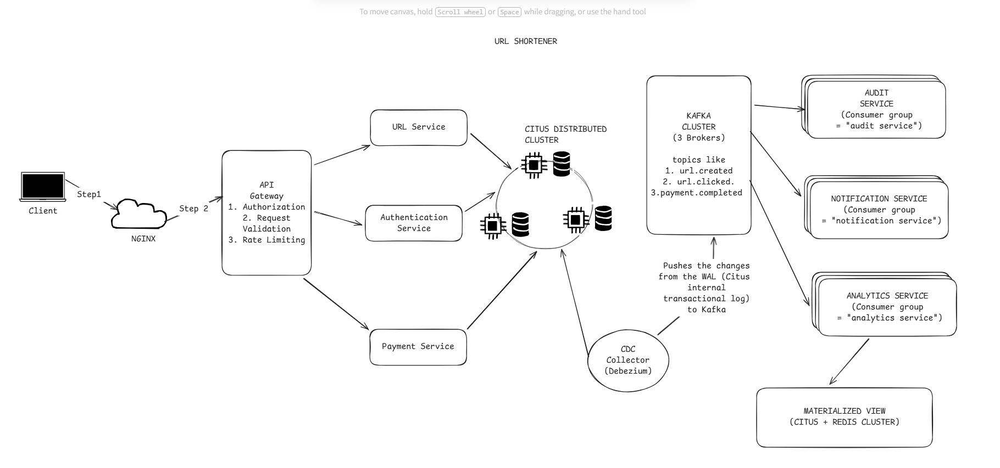

# Distributed URL Shortener: Hashlink

A Production-grade distributed URL shortener built on Citus PostgreSQL, NodeJS, Typescript, and event driven microservice architecture.




## Table of Contents
1. [The Goals of this project](#the-goals-of-this-project)
2. [System Architecture](#system-architecture)
3. [Technologies Used](#technologies--libraries)
4. [Features](#features)
5. [Project Structure](#project-structure)
6. [How to Use it](#how-to-use-it)
7. [API Documentation](#table-of-contents)
8. [Tradeoffs](#table-of-contents)
9. [Monitoring and Observability](#table-of-contents)
10. [Testing Strategy](#testing-strategy)
11. [Performance Bench marks]()
11. [Roadmaps]()


## The Goals of this project
The essence of me building this project is to show in simple terms on how to acheieve an event driven microservice, and enterprise grade 
applications with core engineering focus on the following:

### **Architectural patterns**
1. **Event-Driven Architecture** with Kafka for asynchronous inter-service communication
1. **CQRS (Command Query Responsibility Segregation)** for read and write optimization
1. **Saga Pattern** for distributed transaction cheoreography
1. **Outbox Pattern** for guaranteed at-least-once event delivery
1. **Inbox Pattern** for idempotent message consumption

### **Distributed Database (Citus)**
1. Horizontal sharding with configurable shard count (64 shards)
1. Hash-based distribution by `short_code and userId` for uniform data placement
1. Replication factor of 2 for high availability
1. Worker failure simulation and automatic failover
1. Hot spot detection and shard rebalancing
1. Consistent hashing visualizati1


### **Real-Time Data Streaming**
1. **Change Data Capture (CDC)** with Debezium capturing all table mutations
1. Kafka as event backbone (3-broker cluster for fault tolerance)
1. Event-driven read model synchronization
1. Audit trail generation from database changelog

### **Production-Ready Infrastructure**
1.  Connection pooling with PgBouncer (1000 max clients, 25 per pool)
1.  Redis for distributed caching and session management
1.  JWT-based authentication with refresh token rotation
1.  Role-based access control (Free vs Premium users)
1.  Rate limiting and abuse prevention using Token buceket based algorithm.


### **Observability & Monitoring**
1.  Full-stack monitoring: **Prometheus + Grafana + Loki + Tempo**
1.  Distributed tracing with OpenTelemetry
1.  Custom Citus metrics (shard sizes, replication lag, hot nodes)
1.  Application metrics (p95 latency, error rates, saga success/failure)
1.  CDC lag monitoring and alerting

### **Payment Integration**
1.  Stripe/Paystack for subscription management
1.  Saga-cheoreography payment workflows with compensating transactions
1.  Webhook handling for subscription lifecycle events
1.  Grace period and invoice generation in near real time.


### **Advanced Analytics**
1. Real-time click tracking with deduplication (unique visitors)
1. Geographic distribution (IP geolocation with MaxMind)
1. Device/browser analytics from user-agent parsing
1. Referral source tracking (UTM parameters, referrer headers)
1. Time-series aggregations (hourly/daily/monthly trends)

### **In Progress**
1.  Custom domain support for premium users
1.  QR code generation for short URLs
1.  Chaos engineering tests (network partitions, Byzantine failures)
1.  Multi-region deployment with geo-routing


## System Architecture


**System Data Flows.**
1. **Write Path:** Client > API Gateway > URL Service > Citus (sharded write) > Outbox table
2. **CDC Flow:** Debezium polls outbox transaction log > Publishes to Kafka > Consumers update read models
3. **Read Path (Redirect):** Client > URL Service > Redis cache (L1) > Citus (L2) > 301 redirect
4. **Analytics Path:** Click event > Kafka > Analytics service > TimescaleDB/Materialized view

## Technologies & Libraries

### Core Stack.
1. **Node.js version 20**: The main runtime environment
2. **Typescript version 5**: For typesafe environment
1. **Express 4.18** : Web framework
1. **Citus 13.0.3** : Distributed PostgreSQL
1. **Redis 7.0** : In memory cache and session store
1. **Apache Kafka 3.6** : Event streaming platform

### **Database Layer**
1. **nodejs postgress (pg)**: PostgreSQL client with connection pooling
1. **Debezium version 2.4**: My main change data capture connector
1. **pg bouncer**: For connection pooling ( helps me to create resusauble TCP connection to the database server)
1. **ioredis)**: A redis client that supports also cluster mode


### **Authentication & Security**
1. **jsonwebtoken**: Mainly used to generate JWT tokens and also for token verification.
1. **bcrypt**: Used to generate non reversible hash content for password.
1. **helmet** :Security headers middleware
1. **express.rate-limit** : DDoS protection

### **Monitoring & Observability**
1. **Prometheus** Metrics collection
1. **Grafana** Visualization dashboards
1. **Loki** Log aggregation
1. **Promtail**: For log collection and routing it to Loki for aggregation.
1. **Tempo** : Distributed tracing
1. **OpenTelemetry** : Instrumentation SDK
1. **Winston** : Structured logging


### **Payment Integration**
1. **Paystack SDK**: African payment gateway

### **Development Tools**
1. **Docker Compose**: Local development environment
1. **Nodemon**: Hot-reload for development
1. **Swagger/OpenAPI**: API documentation

## Features


### **1. Core URL Shortening**
1. Short code generation (Base62 encoding, 7-character default, configurable length)
1. Collision detection with exponential backoff retry
1. Custom alias support (premium feature)
1. URL expiration with TTL (configurable per link)
1. Bulk URL creation API (batch processing)
1. URL deactivation/soft delete

### **2. High-Performance Redirects**
1. 2-tier caching: Redis (L1) → Citus (L2)
1. Sub-10ms p95 latency for cached redirects
1. 301 (permanent) vs 302 (temporary) redirect support
1. Click tracking (fire-and-forget, non-blocking)
1. Bot detection and filtering (crawler user-agents)

### **3. Analytics Dashboard**
1. **Total Clicks** - Raw count with deduplication
1. **Unique Visitors** - IP + User-Agent fingerprinting
1. **Click-Through Rate (CTR)** - If impression data available
1. **Time-Series Charts** - Hourly/Daily/Weekly/Monthly trends
1. **Geographic Distribution** - Country/City heatmaps
1. **Device Breakdown** - Mobile/Desktop/Tablet percentages
1. **Browser/OS Stats** - Chrome, Safari, Firefox, etc.
1. **Referral Sources** - Direct, Social, Email, Search
1. **Top Performing URLs** - Ranked by clicks (last 7/30 days)

### **4. User Management**
1. Email/password registration with validation
1. JWT access tokens (15min expiry) + refresh tokens (7 days)
1. Token revocation (blacklisting in Redis)
1. Logout from all devices
1. Role-based access (Free, Premium, Enterprise)
1. User profile with URL ownership

### **5. Premium Features (Subscription-Based)**
1. Custom domains (CNAME verification required)
1. Extended URL expiration (up to 365 days vs 30 days free)
1. Analytics export (CSV/JSON)
1. Priority support
1. No branding on redirect pages

### **6. Distributed System Features**
1. Sharded `urls` table by `short_code` (64 shards, hash distribution)
1. Reference table for `users` (replicated to all workers)
1. Replication factor 2 (survives 1 worker failure)
1. Automatic shard rebalancing after node addition
1. CDC-based event streaming to Kafka
1. Saga orchestration for payment workflows
1. Idempotent message processing with inbox pattern

### **7. Rate Limiting & Abuse Prevention**
1. IP-based rate limiting (100 requests/hour for free, 1000/hour premium)
1. CAPTCHA challenge for suspicious activity
1. URL blacklist (malware/phishing domains)
1. Honeypot links to detect scrapers

### **8. Monitoring & Alerts**
1. **Citus-Specific Metrics:**
  - Shard size distribution (detect hot spots)
  - Replication lag per worker
  - Query distribution across workers
  - Worker health status
1. **Application Metrics:**
  - Request latency (p50, p95, p99)
  - Error rate by endpoint
  - Saga success/failure counts
  - Cache hit ratio (Redis)
1. **Alerting Rules:**
  - Worker down for >1 minute
  - Replication lag >5 seconds
  - Error rate >5% for 5 minutes
  - Payment saga failure spike (>10% in 10min)


## Project Structure


```
distributed-hyperlink/
├── infrastructure/
│   ├── docker/
│   │   ├── development/
│   │   │   ├── docker-compose.yml          # Full dev stack
│   │   │   ├── .env                        # Environment variables
│   │   │   ├── .pgpass                     # Postgres credentials
│   │   │   ├── register-worker.sh          # Worker registration script
│   │   │   └── wait-for-coordinator.sh     # Startup dependency script
│   │   └── production/
│   │       └── docker-compose.yml          # Prod-optimized stack
│   ├── monitoring/
│   │   ├── grafana/
│   │   │   └── dashboards/
│   │   │       ├── citus-metrics.json
│   │   │       ├── application-metrics.json
│   │   │       └── kafka-lag.json
│   │   ├── prometheus/
│   │   │   └── prometheus.yml
│   │   └── loki/
│   │       └── loki-config.yml
│   ├── k8s/                                # Kubernetes manifests (future)
│   ├── terraform/                          # IaC for AWS (future)
│   └── scripts/
│       ├── init-citus.sql                  # Database initialization
│       ├── create-shards.sql               # Shard distribution setup
│       └── load-test.sh                    # K6 load test wrapper
├── services/
│   ├── auth_service/
│   │   ├── src/
│   │   │   ├── controllers/
│   │   │   │   └── auth.controller.ts
│   │   │   ├── services/
│   │   │   │   ├── auth.service.ts
│   │   │   │   └── token.service.ts
│   │   │   ├── repository/
│   │   │   │   └── auth.repository.ts
│   │   │   ├── infrastructure/
│   │   │   │   ├── database/
│   │   │   │   │   ├── models/
│   │   │   │   │   │   ├── user.model.ts
│   │   │   │   │   │   └── dtos/
│   │   │   │   │   └── migrations/
│   │   │   │   ├── cache/
│   │   │   │   │   └── redis.client.ts
│   │   │   │   └── messaging/
│   │   │   │       ├── kafka.producer.ts
│   │   │   │       └── outbox.publisher.ts
│   │   │   ├── shared/
│   │   │   │   ├── errors/
│   │   │   │   ├── logger.ts
│   │   │   │   ├── types.ts
│   │   │   │   └── constants.ts
│   │   │   ├── routes/
│   │   │   │   └── auth.routes.ts
│   │   │   ├── middleware/
│   │   │   │   ├── auth.middleware.ts
│   │   │   │   ├── error.middleware.ts
│   │   │   │   └── validation.middleware.ts
│   │   │   ├── config/
│   │   │   │   └── index.ts
│   │   │   └── server.ts
│   │   ├── tests/
│   │   │   ├── unit/
│   │   │   ├── integration/
│   │   │   └── e2e/
│   │   ├── Dockerfile
│   │   ├── package.json
│   │   └── tsconfig.json
│   ├── url_service/
│   │   ├── src/
│   │   │   ├── commands/                   # The main CQRS Write Side
│   │   │   │   ├── create-url.command.ts
│   │   │   │   ├── delete-url.command.ts
│   │   │   │   └── update-url.command.ts
│   │   │   ├── queries/                    # The main CQRS Read Side
│   │   │   │   ├── get-url.query.ts
│   │   │   │   ├── get-user-urls.query.ts
│   │   │   │   └── get-analytics.query.ts
│   │   │   ├── handlers/
│   │   │   │   ├── create-url.handler.ts
│   │   │   │   ├── redirect.handler.ts
│   │   │   │   └── events/
│   │   │   │       └── url-created.event-handler.ts
│   │   │   ├── services/
│   │   │   │   ├── short-code-generator.service.ts
│   │   │   │   ├── redirect.service.ts
│   │   │   │   └── analytics.service.ts
│   │   │   ├── repository/
│   │   │   │   ├── url.write-repository.ts
│   │   │   │   └── url.read-repository.ts
│   │   │   ├── infrastructure/
│   │   │   │   ├── database/
│   │   │   │   ├── cache/
│   │   │   │   └── messaging/
│   │   │   └── ...
│   │   └── ...
│   ├── payment_service/
│   │   ├── src/
│   │   │   ├── sagas/
│   │   │   │   ├── subscription.saga.ts
│   │   │   │   └── payment.orchestrator.ts
│   │   │   ├── handlers/
│   │   │   │   ├── stripe-webhook.handler.ts
│   │   │   │   └── payment-completed.handler.ts
│   │   │   └── ...
│   │   └── ...
│   ├── analytics_service/
│   │   └── src/
│   │       ├── consumers/
│   │       │   └── click-event.consumer.ts
│   │       ├── aggregators/
│   │       │   ├── daily-stats.aggregator.ts
│   │       │   └── geolocation.aggregator.ts
│   │       └── ...
│   ├── audit_service/
│   │   └── src/
│   │       ├── consumers/
│   │       │   └── cdc-event.consumer.ts
│   │       └── repository/
│   │           └── audit-log.repository.ts
│   └── api_gateway/
│       └── index.ts                      
├── docs/
│   ├── README.md                          
│   ├── TRADEOFFS.md                        # Decision rationale
│   ├── ARCHITECTURE.md                     # Deep-dive design docs
│   ├── API.md                              # API endpoint documentation
│   └── RUNBOOK.md                          # Operational procedures
├── .github/
│   └── workflows/
│       ├── ci.yml                          # CI/CD pipeline
│       └── load-test.yml                   # Automated benchmarking
├── .gitignore
├── LICENSE
└── run_development.sh                      # One-command startup
```


## How to use it


### Prerequisites
1. Docker Engine 24.x+ and Docker Compose 2.x+
1. Node.js 20.x+ (for local development without Docker)
1. 8GB RAM minimum (recommended 16GB for full stack)

### **Quick Start for the (Docker Compose)**


```bash
# 1. Clone repository
git clone https://github.com/yourusername/distributed-hyperlink.git
cd distributed-hyperlink

# 2. Set environment variables
cd infrastructure/docker/development
cp .env.example .env

docker-compose up -d

# 4. Wait for health checks (mostly 30-60 seconds)
docker-compose ps

# 5. Initialize database
docker exec -it citus_coordinator psql -U postgres -d citus_dev -f /init-citus.sql

# 6. Verify shard distribution
docker exec -it citus_coordinator psql -U postgres -d citus_dev \
  -c "SELECT * FROM pg_dist_shard ORDER BY shardid;"

# 7. Access services
# - API Gateway: http://localhost:8000
# - Auth Service: http://localhost:4001
# - URL Service: http://localhost:4002
# - Grafana: http://localhost:3000 (admin/admin)
# - Prometheus: http://localhost:9090
# - RedisInsight: http://localhost:8001
# - Kafka UI: http://localhost:8080
```


## Testing Strategy
### **Test Pyramid**
1. E2E Tests make up 10 perecent of the Test in the app
2. Integration Tests makes up 20 percent
3. Unit Tests takes the remaining 70 percentage

### **Test Coverage Goals**
- Unit: >80%
- Integration: >60%
- E2E: Critical paths only


